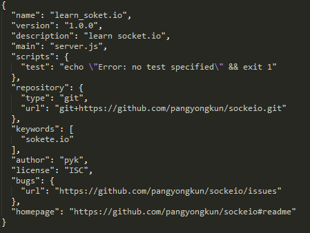
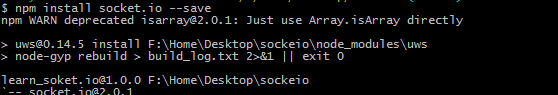

#  
nodejs之socket.io学习 

可用于对nodejs，npm入门学习。 
<a href='https://socket.io/'>socket.io</a>是nodejs的一个websocket通信框架，用来实现点对点通信非常简单。具体可以查看它的<a href="https://socket.io/docs/">开发文档</a>

##  1.初始化项目

生成<a href='package.json'>package.json</a>,中间需要你填入一些信息，之后生成了这些信息。

  

	npm init

 
 

##  2.下载依赖
	ipm install socket.io --save

##  3.新建<a href='server.js'>server.js</a>编写服务器代码

	//引入nodejs的http模块
	var app = require('http').createServer(handler)
	//引入socket.io模块
	var io = require('socket.io')(app);
	var fs = require('fs');
	//监听端口80
	app.listen(80);
	
	//http请求跳转到index.html页面
	function handler (req, res) {
	  fs.readFile(__dirname + '/index.html',
	  function (err, data) {
	    if (err) {
	      res.writeHead(500);
	      return res.end('Error loading index.html');
	    }
	
	    res.writeHead(200);
	    res.end(data);
	  });
	}
	
	//socke.io监听connection事件，这是默认事件
	io.on('connection', function (socket) {
	  //发送事件'news'(这是自定义事件),同时穿过去json数据
	  socket.emit('news', { hello: 'world' });

	  //监听自定义事件'hello'，回掉方法处理数据
	  socket.on('hello', function (data) {
	    console.log(data);
	  });
	});
****
这就实现了一个简单的socket信令服务。

##  4.编写测试页index.html
	<!-- 引入socket.io客户端包 -->
	
	
	
	
这样几行简单的代码就实现了与服务器端的通信。

##  5.启动服务器
	node server.js

##  6.使用请注意

###  1)下载

使用git下载：  

	https://github.com/pangyongkun/socket.io.learn.git
也可以下载：<a href="">压缩包</a>

###  2)安装

安装依赖:

	cd socket.io.learn
	#安装依赖
	npm install
###  3)启动服务
	node server.js

###  4）浏览器中访问

输入：

	http://localhost/

